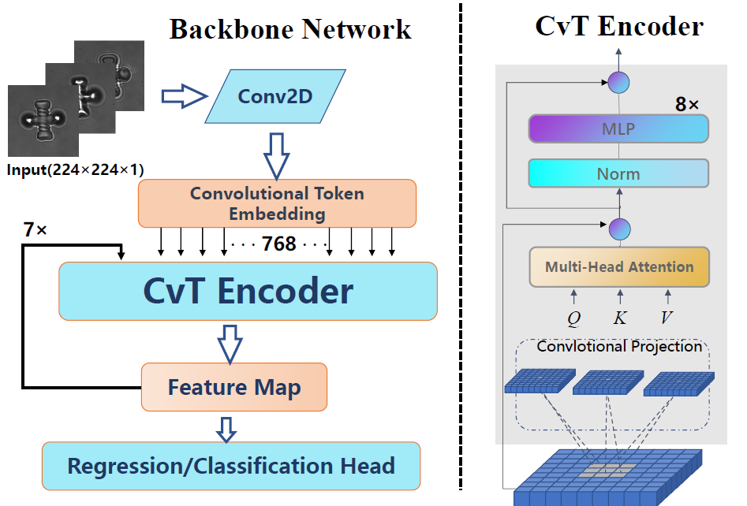

# MicrorobotsPoseEstimation
This is the official implementation of "A Multi-Head Convolutional Vision Transformer Architecture for Microrobot Real-Time Depth and Out-of-Plane Pose Estimation" (IROS 2022)

The key contributions of this paper are threefold:
*  A multi-head Convolutional Vision Transformer model is developed for microrobot depth and out-of-plane pose estimation, which has higher accuracy and less computation time for micro-robot depth and pose estimation.
*  Bayesian Optimization is applied to determine the optimized hyperparameters for the proposed model automatically.
*  Smooth Gad-CAM++	is applied to provide the visual interpretation of the features extracted by the proposed model.

The implementation is as follows.

## Requirements
* To create a new conda environment:
```
conda create -f environment.yaml
```
A new conda environment named as "micro-robots-pytorch" will be established.

## Network

The backbone network combines CvT encoder and is shown as below:
<p align="left">

</p>

And the multi-head network is shown as below:
<p align="left">

</p>

## Training
The experiments has set densenet and resnet as basline models, different models hav different file for training:
```
python train_ViT/train_densenet/train_resnet.py
```

## Testing
* To test all models:
```
python test_all.py
```

##  Evaluation
* To evaluate the results, run this command:
```
python evaluate.py
```

## Results
### Feature Extracted Visualization
* The results of visual interpretations of feature extratced is shown as below:
<p align="left">

</p>

### Depth Estimation
We have set densenet and resnet as the baseline models
* Our model achieves the following performance:

|   With Bayesian Optimization   |  test1(µm)  |     test2(µm)    |        test3(µm)       | mean ± std |
| :-----------------: | :--------------: | :--------------: | :--------------: | :--------------: |
|      microplatform(trail A)    |       0.278       |      0.265       |       0.284      |   0.2757 ± 0.0097   |
|      microplatform(trail B)    |       0.307       |      0.310      |       0.301      |   0.306 ± 0.0046    |
|      microrobot(trail C)    |       0.281      |      0.271       |       0.204      |   0.252 ± 0.0419    |
|      microrobot(trail D)    |       0.292       |      0.286      |       0.222     |   0.2667 ± 0.0388    |

|   With Bayesian Optimization   |  test1(µm)  |     test2(µm)    |        test3(µm)       | mean ± std |
| :-----------------: | :--------------: | :--------------: | :--------------: | :--------------: |
|      microplatform(trail A)    |       0.563       |      0.548       |       0.567      |   0.5593 ± 0.01     |
|      microplatform(trail B)    |       0.484       |      0.463      |       0.495      |   0.4807 ± 0.0163    |
|      microrobot(trail C)    |       0.462      |      0.422       |       0.471      |   0.4517 ± 0.0261    |
|      microrobot(trail D)    |       0.491       |      0.476      |       0.438     |   0.4683 ± 0.0273    |

* Results of prediction and ground truth of 4 trails for depth estimation are shown as below:
<p align="left">

</p>

* Comparisons between the regression model for depth estimation with and without Bayesian Hyperparameters Optimization during training is shown as below:
<p align="left">

</p>

* Comparision exprimetal result is shown as below:
<p align="left">

</p>

### Out-Of-Plane Pose Estimation
* Results of Out-Of-Plane pose estimation:
|       Accuracy      |    Precesion(%)  |     Recall(%)    |        F-1       |
| :-----------------: | :--------------: | :--------------: | :--------------: |
|        99.96        |      99.82       |      99.45       |       99.63      |
